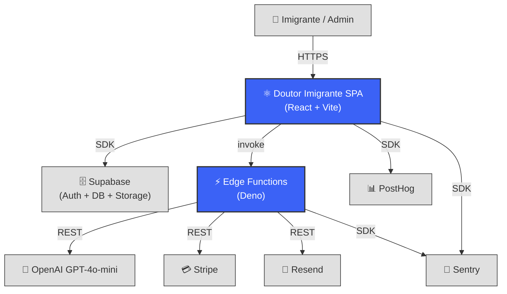
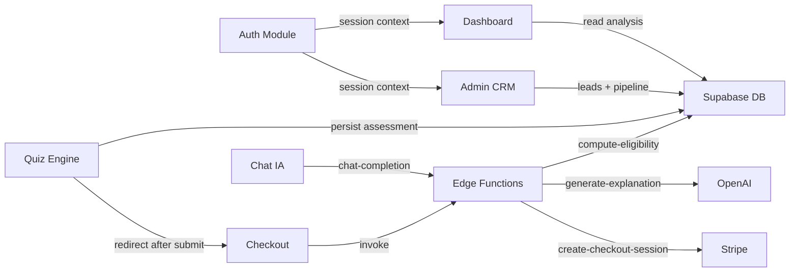
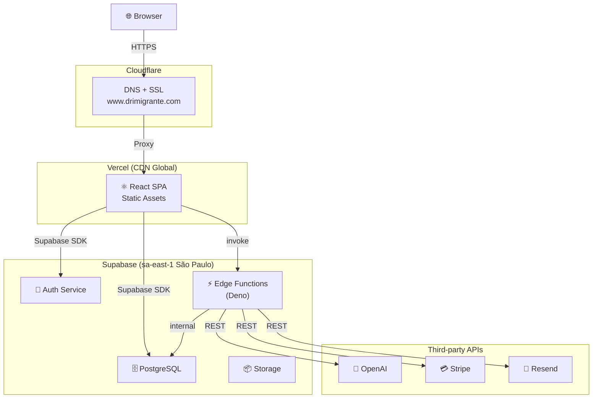

# Architecture Description: Doutor Imigrante

**Version**: 1.0 | **Created**: 2026-05-10 | **Last Updated**: 2026-05-10  
**Architect**: Claude (AI) | **Status**: Draft

---

## 1. Introduction

### 1.1 Purpose

Doutor Imigrante é uma plataforma SaaS multi-tenant que ajuda imigrantes (maioritariamente brasileiros) a avaliar a sua elegibilidade para vistos e residência em Portugal. O sistema guia o utilizador através de um quiz de elegibilidade, gera um diagnóstico jurídico via IA, e suporta o acompanhamento do processo por advogados parceiros.

### 1.2 Scope

**In Scope:**

- Quiz de elegibilidade (anónimo ou autenticado)
- Diagnóstico jurídico pago (€30 one-time)
- Dashboard pessoal do utilizador com análise completa + chat IA
- Acompanhamento contínuo por subscrição (€4,90/mês)
- Painel de administração HUB (CRM, pipeline, gestão de leads/cases)
- Multi-tenant: HUB central + Offices afiliados

**Out of Scope:**

- Submissão de candidaturas directamente às autoridades portuguesas
- Gestão documental avançada (Phase 2)
- App mobile nativa
- Marketplace de advogados (Phase 2+)

### 1.3 Definitions & Acronyms

| Term | Definition |
|------|------------|
| Assessment | Quiz submetido (anónimo ou com email) |
| Lead | Assessment com email/contacto, visível no CRM |
| Case | Lead que pagou — processo aberto com applicants/documentos |
| HUB | Tenant central (Doutor Imigrante) — faz triagem |
| Office | Escritório afiliado — recebe casos atribuídos |
| Elegibilidade | Score calculado determinísticamente + narrado por IA |
| RLS | Row-Level Security — políticas de acesso ao nível da tabela no Supabase |

---

## 2. Stakeholders & Concerns

| Stakeholder | Role | Key Concerns | Priority |
|-------------|------|--------------|----------|
| Imigrante (utilizador final) | Preenchimento do quiz, compra de diagnóstico | Facilidade de uso, privacidade, custo | Critical |
| HUB Admin / Advogado | Triagem de leads, gestão do pipeline | Qualidade do scoring, rapidez de triagem | High |
| Office Admin | Gestão de casos atribuídos | Visibilidade dos seus casos, comunicação com cliente | High |
| Fundador (Rafael) | Produto e operações | Velocidade de entrega, custo de infra, conversão | High |

---

## 3. Architectural Views

### 3.1 Context View

#### 3.1.1 System Scope

SPA React servida via CDN (Vercel), que comunica directamente com Supabase (PostgreSQL + Auth + Storage) e Edge Functions (Deno). A IA (GPT-4o-mini) é invocada apenas via Edge Functions para manter a chave de API segura.

#### 3.1.2 External Entities

| Entity | Type | Interaction Type | Data Exchanged | Protocols |
|--------|------|------------------|----------------|-----------|
| Utilizador final | User | SPA (browser) | Quiz respostas, email, pagamento | HTTPS |
| Supabase | Backend/DB | SDK + REST | Auth, dados, ficheiros | HTTPS/WS |
| OpenAI | AI API | Edge Function → REST | Prompts + completions | HTTPS |
| Stripe | Payments | Edge Function + Webhook | Checkout session, subscription events | HTTPS |
| Resend | Email | Edge Function → REST | Emails transaccionais | HTTPS |
| Vercel | CDN/Deploy | CI/CD | Static assets + serverless | HTTPS |
| PostHog | Analytics | Browser SDK | Eventos de utilizador | HTTPS |
| Sentry | Error tracking | Browser + Edge SDK | Erros, stack traces | HTTPS |
| Cloudflare | DNS/CDN | DNS | Routing, SSL | DNS/HTTPS |
| Google OAuth | Auth | Supabase Auth Provider | OAuth tokens | HTTPS |

#### 3.1.3 Context Diagram



#### 3.1.4 External Dependencies

| Dependency | Purpose | SLA Expectations | Fallback Strategy |
|------------|---------|------------------|-------------------|
| Supabase | Auth + DB primário | 99.9% uptime | localStorage para quiz (offline-first) |
| OpenAI | Scoring narrativo + chat | Best-effort | Mostrar score determinístico sem narrativa |
| Stripe | Pagamentos | 99.99% uptime | Bloquear compra, mostrar erro amigável |
| Resend | Emails transaccionais | 99.9% uptime | Omitir email, não bloquear fluxo |
| Vercel | Deploy + CDN | 99.99% uptime | Cache CDN serve assets mesmo com deploy falho |

---

### 3.2 Functional View

#### 3.2.1 Functional Elements

| Element | Responsibility | Interfaces Provided | Dependencies |
|---------|----------------|---------------------|--------------|
| **Quiz Engine** | Renderizar perguntas condicionais, computar score, persistir assessment | `/quiz`, `/results` | Supabase (assessments), localStorage, quiz-questions.ts |
| **Auth Module** | Magic link + Google OAuth, sessão persistida, roles/subscriptions | `useAuth`, `/login`, `/auth/callback` | Supabase Auth |
| **Checkout** | Criar sessão Stripe, processar webhook, activar acesso | `/checkout`, `/checkout/success` | Stripe, Edge Function `create-checkout-session`, `stripe-webhook` |
| **Dashboard** | Visualização de análise paga, documentos, settings | `/dashboard/*` | Supabase (assessments, cases, messages) |
| **Chat IA** | Conversação contextual sobre o caso do utilizador | `/dashboard/chat` | Edge Function `chat-completion` → OpenAI |
| **Admin CRM** | Gestão de leads, pipeline Kanban, gestão de quiz | `/admin/*` | Supabase (todos os schemas) |
| **Eligibility Engine** | Avaliar elegibilidade determinística via JSON-Logic | Edge Function `compute-eligibility` | Supabase (form_questions, assessments) |
| **Email Service** | Envio de emails (boas-vindas, resultados, follow-up) | Edge Function `send-email` | Resend |
| **Explanation Generator** | Narrativa da análise via IA | Edge Function `generate-explanation` | OpenAI |

#### 3.2.2 Element Interactions



#### 3.2.3 Functional Boundaries

**What this system DOES:**
- Avaliar elegibilidade de vistos PT via quiz interactivo
- Gerar diagnóstico jurídico narrativo via IA
- Processar pagamentos one-time e subscrições recorrentes
- Suportar pipeline CRM de triagem de leads
- Multi-tenant: HUB + Offices

**What this system does NOT do:**
- Submeter candidaturas oficiais às autoridades
- Garantir resultados jurídicos (é informativo, não consultoria legal)
- Processar documentos com OCR (Phase 2)
- Comunicação em tempo real (WebSockets — Phase 2)

---

### 3.3 Information View

#### 3.3.1 Data Entities

| Entity | Storage Location | Owner Component | Lifecycle | Access Pattern |
|--------|------------------|-----------------|-----------|----------------|
| `tenants` | PostgreSQL | Admin CRM | Criado manualmente | Read-heavy |
| `profiles` | PostgreSQL | Auth Module | Criado no sign-up | Read-heavy |
| `user_roles` | PostgreSQL | Auth Module | Gerido pelo HUB | Read-heavy |
| `subscriptions` | PostgreSQL | Checkout | Criado/actualizado via Stripe webhook | Read-heavy |
| `assessments` | PostgreSQL | Quiz Engine | Criado no submit; actualizado com score | Write-once, read-many |
| `leads` | PostgreSQL | Admin CRM | Criado a partir de assessment com email | Update-heavy (pipeline) |
| `cases` | PostgreSQL | Admin CRM | Criado quando lead paga | Update-heavy |
| `form_questions` | PostgreSQL + localStorage | Quiz Engine | Gerido pelo Admin Quiz | Read-heavy (cached) |
| `messages` | PostgreSQL | Chat IA | Append-only | Write-heavy |
| `ai_configs` | PostgreSQL | Admin AI Config | Raramente actualizado | Read-heavy |
| `chat_sessions` | PostgreSQL | Chat IA | Criado por utilizador/case | Read/write |

#### 3.3.2 Data Flow

**Key Data Flows:**

1. **Quiz Submit**: Browser → `useQuiz.submitQuiz()` → `persistAssessment()` → Supabase `assessments` + `leads` → Edge Function `compute-eligibility` (async)
2. **Pagamento**: Browser → `/checkout` → Edge Function `create-checkout-session` → Stripe → Webhook → Edge Function `stripe-webhook` → Supabase `subscriptions` + `cases`
3. **Chat IA**: Browser → Edge Function `chat-completion` → OpenAI GPT-4o-mini → Supabase `messages`
4. **Auth Flow**: Browser → Supabase Auth (Magic Link / Google OAuth) → `/auth/callback` → `useAuth` carrega profile + subscription + roles

#### 3.3.3 Data Quality & Integrity

- **Consistency Model**: ACID transactions via PostgreSQL; Supabase garante strong consistency
- **Validation Rules**: Zod schemas no frontend; RLS policies no Supabase para autorização
- **Retention Policy**: Dados de utilizador mantidos indefinidamente (RGPD — Phase 2 adiciona direito de apagamento)
- **Backup Strategy**: Supabase backups automáticos diários (plano Pro)

---

### 3.4 Concurrency View

#### 3.4.1 Process Structure

| Process | Purpose | Scaling Model | State Management | Resource Limits |
|---------|---------|---------------|------------------|-----------------|
| SPA (browser) | UI + client-side logic | Sem escala (por utilizador) | TanStack Query cache + localStorage | N/A |
| Edge Functions (Deno) | Lógica de backend segura | Horizontal automático (Supabase) | Stateless | 150ms CPU / 50MB RAM por invocação |
| Supabase DB | Persistência | Vertical (plano Supabase) | PostgreSQL ACID | Supabase Pro plan |

#### 3.4.2 Thread Model

- **Threading Strategy**: Event-driven single-thread no browser; Deno async/await nas Edge Functions
- **Async Patterns**: `async/await` em toda a app; TanStack Query gere cache + revalidation
- **Resource Pools**: Supabase connection pool gerido pelo plataforma

#### 3.4.3 Coordination Mechanisms

- **Synchronization**: TanStack Query `invalidateQueries` após mutations para forçar revalidação
- **Communication**: Supabase Realtime (não usado no MVP — Phase 2 para chat ao vivo)
- **Deadlock Prevention**: `useAuth` usa timeout de 8s para garantir que loading flag é always cleared; `onAuthStateChange` callback é síncrono, DB calls são deferidos com `setTimeout(0)`

---

### 3.5 Development View

#### 3.5.1 Code Organization

```text
drImigrante/
├── src/
│   ├── App.tsx                  # Root — QueryClientProvider + RouterProvider
│   ├── main.tsx                 # Entry point — Sentry + PostHog init
│   ├── router/
│   │   ├── index.tsx            # createBrowserRouter — todas as rotas
│   │   └── ProtectedRoute.tsx   # Guard: auth + isHubUser + requirePaid
│   ├── pages/
│   │   ├── LandingPage.tsx      # Home pública
│   │   ├── quiz/                # QuizPage + ResultsPage
│   │   ├── auth/                # LoginPage + AuthCallbackPage
│   │   ├── checkout/            # CheckoutPage + SuccessPage
│   │   ├── dashboard/           # DashboardHome, Analysis, Chat, Documents, Settings
│   │   └── admin/               # Dashboard, Leads, Pipeline, Quiz, Tenants, AiConfig, Settings
│   ├── components/
│   │   ├── layout/              # Layout, DashboardLayout, AdminLayout, Header, Footer
│   │   ├── quiz/                # QuizIntro, QuizQuestion, QuizProgress, QuizCaptureForm, QuizQuestionEditor
│   │   └── ui/                  # shadcn/ui components (Radix primitives)
│   ├── hooks/
│   │   ├── useAuth.ts           # Session, profile, roles, subscription, signIn/Out
│   │   ├── useQuiz.ts           # State machine do quiz (orquestra os sub-hooks)
│   │   ├── useQuizState.ts      # useReducer para flow state
│   │   ├── useQuizPersistence.ts# localStorage + sessionId
│   │   ├── useQuizQuestions.ts  # TanStack Query — form_questions da DB
│   │   ├── useAssessment.ts     # persistAssessment() → Supabase
│   │   └── useQuizAdmin.ts      # Queries admin para gestão de perguntas
│   ├── data/
│   │   └── quiz-questions.ts    # Perguntas hardcoded + computeScore + suggestVisas
│   └── lib/
│       ├── supabase.ts          # createClient com tipos gerados
│       ├── database.types.ts    # Tipos gerados pelo Supabase CLI
│       ├── query-client.ts      # TanStack QueryClient config
│       └── utils.ts             # cn() e helpers
├── supabase/
│   ├── migrations/              # SQL migrations (Supabase CLI)
│   └── functions/               # Edge Functions (Deno)
│       ├── chat-completion/
│       ├── compute-eligibility/
│       ├── create-checkout-session/
│       ├── generate-explanation/
│       ├── send-email/
│       └── stripe-webhook/
├── public/                      # Assets estáticos
├── .env.local                   # Variáveis de ambiente (não commitado)
├── vite.config.ts
├── tailwind.config.ts
└── vercel.json
```

#### 3.5.2 Module Dependencies

**Dependency Rules:**
- `pages/` importa de `hooks/`, `components/`, `lib/`
- `hooks/` importa de `lib/` e `data/`
- `components/` importa de `hooks/` e `lib/`
- `lib/` não importa nada interno (leaf layer)
- Edge Functions são independentes da SPA — comunicam apenas via HTTP
- Sem dependências circulares permitidas

#### 3.5.3 Build & CI/CD

- **Build System**: Vite 5 + TypeScript + Rollup (bundler interno)
- **CI Pipeline**: Vercel auto-deploy em push para `main`
  1. `npm run build` (tsc + vite build)
  2. Deploy automático para preview (branches) ou produção (main)
- **Artifact Management**: Vercel Edge Network (CDN global)
- **Deployment Strategy**: Atomic deploys — rollback instantâneo pelo painel Vercel

#### 3.5.4 Development Standards

- **Coding Standards**: TypeScript strict; ESLint; Prettier (via Vite defaults)
- **Review Requirements**: Solo founder — sem processo formal de PR no MVP
- **Testing Requirements**: MVP sem testes automatizados — Phase 2 adiciona Vitest + Playwright
- **Documentation Requirements**: `.spec/` para arquitectura e specs de features

---

### 3.6 Deployment View

#### 3.6.1 Runtime Environments

| Environment | Purpose | Infrastructure | Scale | Configuration |
|-------------|---------|----------------|-------|---------------|
| Production | Utilizadores reais | Vercel CDN + Supabase sa-east-1 | Auto (Vercel serverless) | `.env` no Vercel Dashboard |
| Local Dev | Desenvolvimento | localhost:5173 (Vite dev server) | 1 processo | `.env.local` |

#### 3.6.2 Network Topology



#### 3.6.3 Third-Party Services

| Service | Provider | Purpose | Cost Model |
|---------|----------|---------|------------|
| Supabase | Supabase Inc. | Auth + PostgreSQL + Edge Functions + Storage | Pro plan ~$25/mês |
| Vercel | Vercel Inc. | Deploy + CDN | Hobby (gratuito) ou Pro |
| OpenAI | OpenAI | GPT-4o-mini — scoring narrativo + chat | Pay per token |
| Stripe | Stripe Inc. | Pagamentos PT (EUR) | 1.4% + €0.25 por transacção |
| Resend | Resend Inc. | Emails transaccionais | Free tier (3k emails/mês) |
| Cloudflare | Cloudflare Inc. | DNS + SSL | Free plan |
| PostHog | PostHog Inc. | Product analytics | Free tier (1M eventos/mês) |
| Sentry | Sentry Inc. | Error tracking | Free tier |

---

### 3.7 Operational View

#### 3.7.1 Monitoring & Alerting

- **Key Metrics Collected**:
  - Quiz completion rate (PostHog funnel)
  - Conversão quiz → checkout → pagamento (PostHog)
  - Erros JS + Edge Function errors (Sentry)
  - Score distribution por categoria (PostHog events)
  - Latência das Edge Functions (Supabase dashboard)

- **Alerting Rules**:
  - Sentry: erro novo em produção → email imediato (founder)
  - Stripe: webhook failure → retry automático + Stripe dashboard alert

- **Logging Strategy**:
  - Edge Functions: `console.log` capturado pelo Supabase Logs (7 dias)
  - Browser errors: Sentry (90 dias)
  - Audit trail: tabela `audit_logs` no PostgreSQL

#### 3.7.2 Disaster Recovery

- **RTO**: ~15 minutos (redeploy via Vercel + Supabase managed)
- **RPO**: ~24 horas (backup diário automático Supabase)
- **Recovery Procedures**: Rollback via Vercel dashboard; restauro de DB via Supabase dashboard

---

## 4. Architectural Perspectives

### 4.1 Security Perspective

#### 4.1.1 Authentication & Authorization

- **Identity Provider**: Supabase Auth — Magic Link (email OTP) + Google OAuth
- **Authorization Model**: RBAC via tabela `user_roles` (super_admin, hub_admin, office_admin, lawyer, paralegal, client) + RLS policies ao nível da DB
- **Session Management**: JWT tokens geridos pelo Supabase Auth SDK; refresh automático

#### 4.1.2 Data Protection

- **Encryption at Rest**: Gerido pelo Supabase (AES-256)
- **Encryption in Transit**: TLS 1.3 em todos os endpoints
- **Secrets Management**: Chaves privadas (OpenAI, Stripe secret, Resend) apenas em Edge Functions via Supabase Secrets; frontend só usa `VITE_` prefixed keys (anon key, publishable Stripe key)
- **PII Handling**: Emails e nomes em `assessments` e `profiles`; RGPD compliance planeada para Phase 2

#### 4.1.3 Threat Model

| Threat | Likelihood | Impact | Mitigation |
|--------|------------|--------|------------|
| RLS bypass / data leak | Low | Critical | RLS policies em todas as tabelas tenant-scoped; testes manuais |
| API key exposure | Low | High | Chaves privadas apenas em Edge Functions; `.env.local` no gitignore |
| Quiz spam / bot abuse | Medium | Medium | Rate limiting via Supabase (Phase 2); CAPTCHA opcional |
| Stripe webhook replay | Low | High | Verificação de assinatura Stripe no webhook handler |

---

### 4.2 Performance & Scalability Perspective

#### 4.2.1 Performance Requirements

| Metric | Target | Method |
|--------|--------|--------|
| First Contentful Paint | <1.5s | Vercel CDN + lazy loading |
| Quiz interaction latency | <100ms | Client-side state machine |
| Assessment persist | <500ms | Supabase direct SDK call |
| Chat response (first token) | <2s | OpenAI streaming (Phase 2) |

#### 4.2.2 Scalability Model

- **Frontend**: Stateless SPA — escala infinitamente via Vercel CDN
- **Backend**: Supabase gere connection pooling + Edge Function scaling automaticamente
- **Bottleneck esperado no MVP**: Supabase Pro plan (500MB DB, 5GB storage) — upgrade trivial se necessário

---

## 5. Global Constraints & Principles

### 5.1 Technical Constraints

- Supabase sa-east-1 (São Paulo) — optimizado para utilizadores brasileiros
- Stripe em EUR (Portugal) — conta pessoal inicial; upgrade para conta empresa na Phase 2
- Edge Functions em Deno — sem npm packages; usar esm.sh para imports
- Frontend serve via CDN — sem SSR (SPA pura)
- TypeScript strict em todo o código

### 5.2 Architectural Principles

- **Auth híbrido**: Quiz anónimo → captura email no Step final → conta no checkout
- **Supabase como fonte da verdade**: RLS define autorização; sem lógica de negócio duplicada no frontend
- **Graceful degradation**: Falha do Supabase no quiz não bloqueia utilizador (localStorage fallback)
- **IA como camada narrativa**: Score determinístico (JSON-Logic) + narrativa gerada por IA — dois layers separados
- **Secrets no servidor**: Chaves privadas NUNCA no frontend — sempre em Edge Functions

---

## 6. Architecture Decision Records (ADRs)

| ID | Decision | Status |
|----|----------|--------|
| ADR-001 | Greenfield com componentes dos projetos legados | Accepted |
| ADR-002 | Supabase direto (sem BFF/API layer) | Accepted |
| ADR-003 | Auth híbrido: anónimo → email → conta | Accepted |
| ADR-004 | Rules Engine híbrido: JSON-Logic + IA narrativa | Accepted |
| ADR-005 | Multi-tenant desde o início (HUB + Offices) | Accepted |
| ADR-006 | Região Supabase: sa-east-1 (São Paulo) | Accepted |
| ADR-007 | Stripe em EUR (conta PT pessoal no MVP) | Accepted |

*(Ver `memory/architecture_decisions.md` para detalhes completos dos 17 ADRs)*

---

## Appendix

### C. Tech Stack Summary

**Languages**: TypeScript 5.x (strict), SQL (PostgreSQL 15), TypeScript/Deno (Edge Functions)  
**Frameworks**: React 18, React Router v6, TanStack Query v5, React Hook Form, Zod  
**UI**: Tailwind CSS v3, shadcn/ui (Radix primitives), Lucide Icons  
**Database**: PostgreSQL 15 (via Supabase), 27 tabelas, RLS em todas  
**Infrastructure**: Vercel (CDN + deploy), Supabase (sa-east-1), Cloudflare (DNS)  
**Payments**: Stripe (EUR, TEST mode no MVP)  
**AI**: OpenAI GPT-4o-mini  
**Email**: Resend (mail.drimigrante.com verified)  
**Analytics**: PostHog (phc_vn9QEvkb...), GA4 (G-BB3RYSCSJ9)  
**Error Tracking**: Sentry (React + Node.js DSNs)  
**Build**: Vite 5  
**CI/CD**: Vercel auto-deploy (push to main)
